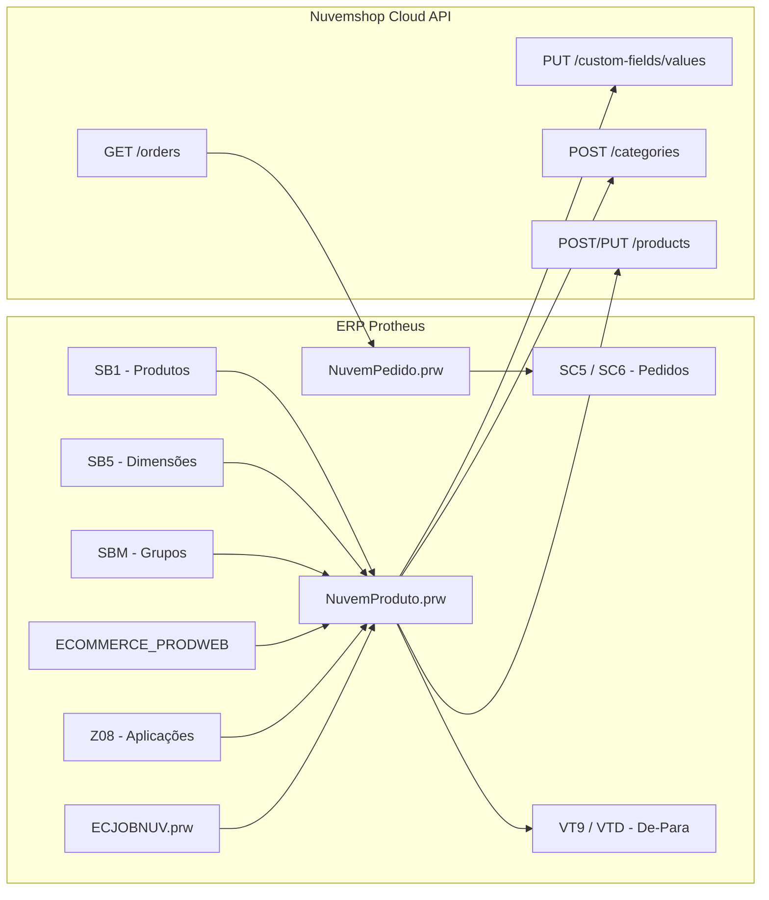

# Integração TOTVS Protheus x Nuvemshop

> Solução corporativa desenvolvida em **ADVPL** para integração bidirecional e homologada entre o ERP **TOTVS Protheus** e a plataforma de e-commerce **Nuvemshop** via API REST.

---

## 📌 Visão Geral da Arquitetura

A integração opera com arquitetura modular e desacoplada, utilizando chamadas REST autenticadas (Bearer Token) com tratamento resiliente de Rate Limit (HTTP 429), suporte a versões de API `unstable` (Custom Fields e Custom Objects) e persistência de de-para nativo no ERP.

---

## 📁 Estrutura dos Fontes

| Fonte | Tipo | Responsabilidade / Descrição |
| :--- | :--- | :--- |
| **`NuvemAcesso.prw`** | Classe | Camada base de comunicação HTTP REST. Gerencia Bearer Token, cabeçalhos obrigatórios (`User-Agent`) e algoritmo de retry para Rate Limit (`x-rate-limit-reset`). |
| **`NuvemProduto.prw`** | Classe | Motor completo de catálogo: extração de dados (`SB1`, `SB5`, `SBM`, `Z08`, `Z09`, `ECOMMERCE_PRODWEB`), categorização automática, cubagem/peso, fotos e Custom Fields veiculares. |
| **`NuvemPedido.prw`** | Classe | Sincronização e importação de pedidos de venda da Nuvemshop para as tabelas padrão de pedidos do Protheus (`SC5` e `SC6`). |
| **`ECJOBNUV.prw`** | Função / Job | Ponto de entrada para execução em segundo plano via TOTVS Schedule, processando filas em lote contínuo. |
| **`NuvTestCatalog.prw`** | Interface SmartClient | Painel interativo com 4 rotinas de testes: teste de token, visualização dos dados consolidados, exportação unitária e simulação de carga. |
| **`U_TestNuvCon.prw`** | Função de Diagnóstico | Teste rápido de conectividade e validação da chave de autenticação com a Nuvemshop. |

---

## ⚙️ Parâmetros do Protheus (SX6)

A integração é totalmente configurável via parâmetros nativos do ERP:

* `MV_NUVSTOR`: Store ID (Identificador da loja na Nuvemshop).
* `MV_NUVTOK`: Bearer Token de acesso permanente à API.
* `MV_NUVAPP`: App ID cadastrado na plataforma Nuvemshop Partners.
* `MV_NUVUAGT`: User-Agent obrigatório no formato `NomeApp (email@dominio.com)`.
* `MV_NUVFIL`: Filial padrão de estoque e preço no Protheus (ex: `03150001`).
* `MV_NUVIMG`: URL base externa pública para download das imagens (ex: `https://dominio.com.br/imagens/`).

---

## 📊 Rastreabilidade e De-Para no ERP

A amarração entre os identificadores do Protheus e da Nuvemshop é persistida nas tabelas oficiais de e-commerce do Protheus:
* **`VT9` (De-Para de Produtos):** Armazena o vínculo entre `B1_COD` e o `ID` do produto na Nuvemshop.
* **`VTD` (De-Para de Variantes):** Armazena o vínculo de SKU/Grade com o `variant_id` da Nuvemshop.

---

## 🚗 Campos Personalizados e Compatibilidade Veicular

A solução inclui suporte nativo a **Custom Fields e Custom Objects** na Nuvemshop sob namespace dedicado:
* **Montadoras Compatíveis** (`montadoras`) com auto-cadastro dinâmico no Custom Object.
* **Modelos Compatíveis** (`modelos`) com auto-cadastro dinâmico no Custom Object.
* **Ano Inicial / Ano Final** (`ano-inicial`, `ano-final`).
* **Aplicação Técnica** (`aplicacao`).
* **Código de Peça / Referência Fortbras** (`codigo-fortbras`).

---

## 📄 Documentação e Relatórios Técnicos

* [Relatório Técnico de Homologação (HTML)](Relatorio_Tecnico_Integracao_Nuvemshop.html)
* [Relatório Técnico de Homologação (PDF)](Relatorio_Tecnico_Integracao_Nuvemshop.pdf)

---

## 👨‍💻 Autor e Mantenedor

* **Claudio Guidi** — Engenheiro e Especialista Protheus / ADVPL  
* **GitHub:** [@claudioguidi9-eng](https://github.com/claudioguidi9-eng)
